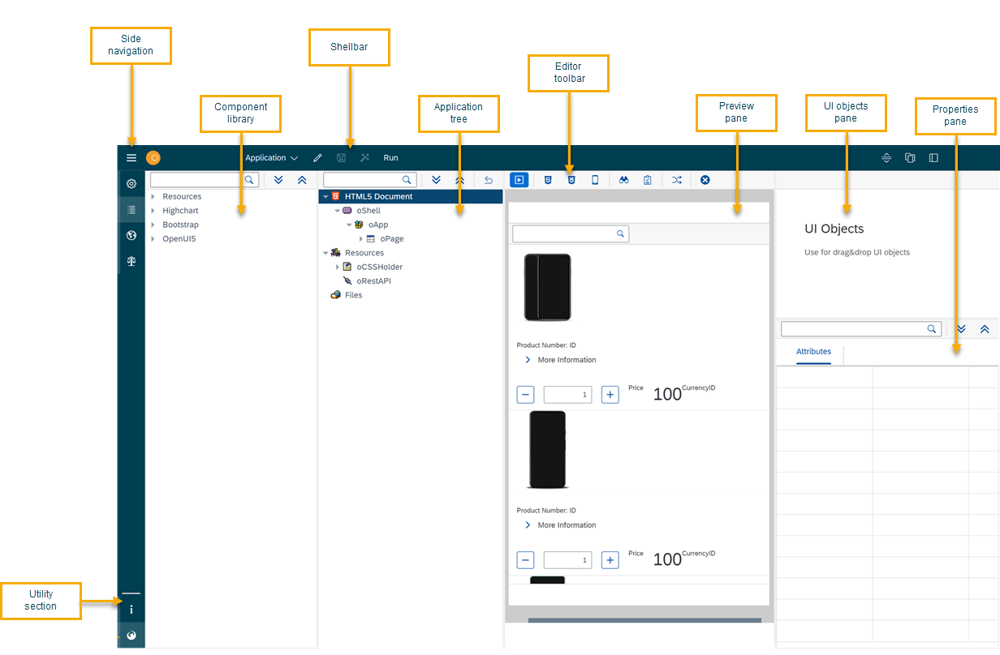

= App Designer interface at a glance

The _App Designer_ interface consists of the following elements:

//Helle@parson: added anchors, reordered by importance, added information, corrected conceptual error (reusable vs. application panel), new SUIs (GUI changed)

* xref:_menu[]
* xref:_toolbar[]
* xref:_editor_tools[]
* xref:_reusable_component_panel[]
* xref:_application_component_panel[]
* xref:_ui_object_panel[]
* xref:_component_properties_panel[]
* xref:_application_preview_panel[]
* xref:_open_ui5[]
* xref:_neptune_community[]
//Helle@Fabian: is adding block ID necessary/recommended?

//Helle@parson: new SUI, a bit clearer and in standard view. Preferences? new ^, old v
image:appdesigner-interface.png["appdesigner-interface",width=800]

== Menu

When you open the _App Designer_, you will only see the icons.
Toggle the items by clicking the *Menu* icon.

The *Menu* includes the following items:

image:appdesigner-menu.png["appdesigner-menu",width=200]

Settings:: Configure the OpenUI5 version and application properties.
Designer:: You start here when you open the _App Designer_. Develop your application.
Translation:: Translate the text of screen objects.
Version Management:: Manage different versions of your files.

== Toolbar
The *Toolbar* includes the following items:

image:appdesigner-toolbar.png["appdesigner-toolbar",width=800]

Application:: Open, create, delete, or copy applications.
Export and import applications, run a global search to find javascript code across all applications, generate a version, and refresh the master data.
Display/Edit:: Click to toggle to Edit or Display mode.
Save:: Save your application. This saves all changes but does not apply the changes to the preview.
Activate:: Save and activate your application. This saves changes and restarts the preview with all changes applied.
Run:: Run the application in a separate browser tab.
Screen views:: Switch panel views.
The standard _App Designer_ view has four panels: The *Reusable component* panel, *Application component* panel, *Application preview* panel, and *UI object* panel.
+
* image:cockpit-overview:appdesigner-views-stack.png[width=45]
Combine the *Reusable component* panel and *Application component* panel.
* image:cockpit-overview:appdesigner-views-switch.png[width=45]
Switch *Application component* panel and *UI object* panel.
* image:cockpit-overview:appdesigner-views-hideUI.png[width=45]
Hide the *UI object* panel.

== Editor tools
The *Editor tools* include the following items:

image:appdesigner-editortools.png["appdesigner-editortools",width=800]

Expand and Collapse:: Expand and collapse groups of the *Application component* panel.
Undo:: Undo your last changes.
Run:: Run a preview of the application in the _App Designer_ and edit settings for the preview.
Header:: The header editor
//Input needed: is this where I define a global HTML5 head for my application?
Stylesheet:: The stylesheet editor
//Input needed: is this the global css sheet for my application?

//Web App Manifest editor
//Input needed

Script search:: Open the *Search and ToDo List* panel and search for scripts.
ToDo List:: Open the *Search and ToDo List* panel.
//@ Neptune: Input needed, what do I do here?
Display Data Flow:: Display data flows for APIs and UI5 models.

Easily switch between opened tabs.
Click *Close all tabs* to close all open tabs.

== Reusable component panel
The *Reusable component* panel shows the components that you can use for building your application.
Components are user-interface elements that you can drag and drop into the upper application component panel to build your application.

Components are divided into four sections:

* Resource components, for example, to use Javascript and RestAPIs
* Highchart components to create graphs and plots
* Bootstrap components to make your application responsive
* OpenUI5 components to design and structure your application

image:appdesigner-reusable-component.png["appdesigner-reusable-component.png",width=200]

== Application component panel
The *Application component* panel shows the current state of your application.
You use components from the *Reusable component* panel to build and structure your application here.

== UI object panel
The *UI object* panel lets you define the component name and enter a corresponding description.
Depending on the selected component in the *Application component* panel, you also can enter a model source and a model path.

image:appdesigner-ui-objectpanel.png["appdesigner-ui-objectpanel",width=400]

== Component properties panel
The *Component properties* panel shows the attributes of a component.
You can define properties or events to change the layout and behavior of a component.

image:appdesigner-properties-components.png["appdesigner-properties-components.png",width=400]

== Application preview panel
The *Application preview* panel shows a preview of your application.

image:appdesigner-application-preview.png["appdesigner-application-preview.png",width=400]

== Open UI5
*Open UI5* opens a website providing UI5 resources, such as a detailed documentation on Open UI5 components, API reference, and samples.

== Neptune Community
*Neptune Community* opens the community website giving you access to the latest product updates, the documentation, technical support, blogs, and our e-learning material.

